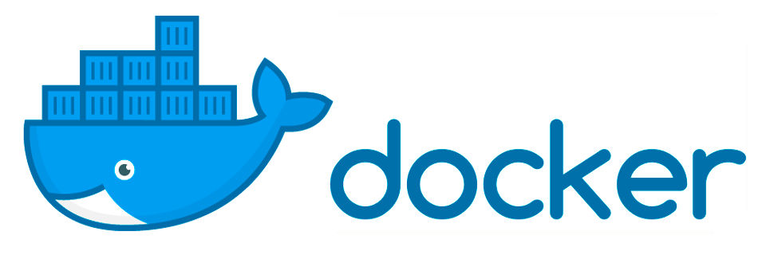

<p align="center">
  </a>
</p>

## 📝 Summary

[EN]

Kube-News Security is a repository based on the Kube-News project, with the goal of applying best security and performance practices when creating containers. The focus of this repository is to demonstrate how to build, in a secure and efficient way, a containerized environment for running applications — in this specific case, an application developed in Node.js.

[PT-BR]

Kube-News Security é um repositório baseado no projeto Kube-News, com o objetivo de aplicar as melhores práticas de segurança e desempenho na criação de containers. O foco deste repositório é demonstrar como construir, de forma segura e eficiente, um ambiente containerizado para execução de aplicações — neste caso específico, uma aplicação desenvolvida em Node.js.

---

## 📦 Estrutura do Projeto

```
/
├── src/                      # Código-fonte principal
│   ├── models/               # Modelos de dados
│   │   └── post.js           # Definição do modelo Post
│   ├── views/                # Templates EJS
│   │   ├── partial/          # Componentes parciais (header, footer)
│   │   ├── edit-news.ejs     # Formulário de edição
│   │   ├── index.ejs         # Página principal
│   │   └── view-news.ejs     # Visualização de notícia
│   ├── static/               # Arquivos estáticos (CSS, imagens)
│   ├── middleware.js         # Middlewares personalizados
│   ├── server.js             # Ponto de entrada da aplicação
│   ├── system-life.js        # Endpoints de health check
│   └── package.json          # Dependências
├── .dockerignore             # Documentação
├── .env                      #
├── cosign.pub                # 
├── docker-compose.yaml       # 
├── Dockerfile                # 
├── popula-dados.http         # Arquivo para popular o banco com dados de exemplo
└── README.md                 # Documentação
```

## 🚧 Variáveis de Ambiente

Para configurar a aplicação, defina as seguintes variáveis de ambiente:

| Variável | Descrição | Valor Padrão |
|----------|-----------|--------------|
| DB_DATABASE | Nome do banco de dados | kubedevnews |
| DB_USERNAME | Usuário do banco de dados | kubedevnews |
| DB_PASSWORD | Senha do usuário | Pg#123 |
| DB_HOST | Endereço do banco de dados | localhost |
| DB_PORT | Porta do banco de dados | 5432 |
| DB_SSL_REQUIRE | Habilitar SSL para conexão | false |


## 🚨 Segurança

Este repositório tem como objetivo demonstrar a criação e configuração de containers e imagens Docker. Alguns arquivos foram incluídos apenas para fins ilustrativos. Jamais publique arquivos sensíveis em repositórios públicos, pois isso pode acarretar sérios riscos de segurança.
